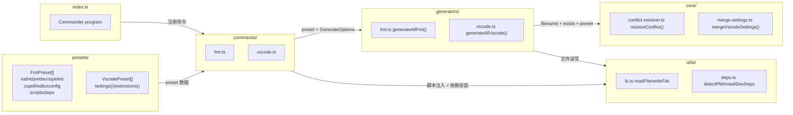

# CLAUDE.md

一键式项目格式化和 VSCode 配置初始化的 CLI 工具。它从预定义预设生成 ESLint、Prettier、Stylelint、CSpell、EditorConfig 配置和 VSCode 设置，具备智能合并和冲突解析功能。

## 技术要求

- **Node.js 18+** (仅 ESM 运行时)
- **bun** (包管理器 & 任务执行器)
- **模块系统** ESM-only（"type": "module"）

## 技术栈选型

| 层面     | 技术                       |
| -------- | -------------------------- |
| 语言     | TypeScript                 |
| CLI 框架 | Commander                  |
| 终端样式 | Chalk 5                    |
| 构建     | tsup                       |
| 测试     | Vitest                     |
| 包管理   | Bun                        |
| 代码质量 | ESLint + Prettier + CSpell |

## 命令

```bash
bun run code:check:all               # 运行检查代码lint
bun run code:fix:all                 # 运行修复代码lint
bun run test                         # 单元 + 验收
bun run test --project unit          # 单元测试
bun run test --project acceptance    # 验收测试
```

**注意：**验收测试会启动 `dist/index.js` — 如果 dist 是旧的，在 ` test` 前先运行 `build`

## 项目目录

```
src/
├── commands/         # CLI 命令处理器 (fmt, update, vpn, show, vscode等等)
├── generators/       # 文件生成逻辑（写目标配置用） (fmt, vscode)
├── core/             # 核心决策层：冲突解析 & 设置合并引擎
├── presets/          # 预设定义 (提供预设模板)
├── utils/            # 工具函数 (deps, version等)
└── index.ts          # CLI 入口 (commander)
tests/
├── **/*.test.ts      # 单元测试 (并行, 快速超时)
├── **/*.spec.ts      # 验收测试 (串行, 进程池, 30s 超时)
└── helpers/          # 测试辅助工具 (.ts)
```

## 架构数据流图


