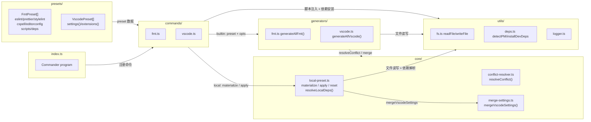

# CLAUDE.md

一键式项目格式化和 VSCode 配置初始化的 CLI 工具。它从预定义预设生成 ESLint、Prettier、Stylelint、CSpell、EditorConfig 配置和 VSCode 设置，具备智能合并和冲突解析功能。

## 技术要求

- **Node.js 18+** (仅 ESM 运行时)
- **bun** (包管理器 & 任务执行器)
- **模块系统** ESM-only（"type": "module"）

## 技术栈选型

| 层面     | 技术                       |
| -------- | -------------------------- |
| 语言     | TypeScript                 |
| CLI 框架 | Commander                  |
| 终端样式 | Chalk 5                    |
| 构建     | tsup                       |
| 测试     | Vitest                     |
| 包管理   | Bun                        |
| 代码质量 | ESLint + Prettier + CSpell |

## 命令

```bash
bun run eslint                       # eslint
bun run cspell                       # cspell
bun run type:check                   # ts 类型检查
bun run format                       # 格式化代码
bun run test                         # 单元 + 验收
bun run test --project unit          # 单元测试
bun run test --project acceptance    # 验收测试
```

**注意：**

- 验收测试会启动 `dist/index.js` — 如果 dist 是旧的，在 `test` 前先运行 `build`
- 验收测试较慢，**不要跑全量验收**。优先用 `-t` 过滤只跑与改动相关的必要测试：

## 项目目录

```
src/
├── commands/         # CLI 命令处理器 (fmt, vscode, init, update, vpn, show)
├── generators/       # 文件生成逻辑（写目标配置用） (fmt, vscode, init)
├── core/             # 核心决策层：冲突解析、设置合并、本地预设物化/应用
├── presets/          # 预设定义 (提供预设模板)
│   ├── fmt/          # fmt 预设模板 (web-vue, web-react, nest, node 等)
│   ├── vscode/       # vscode 预设模板
│   └── skills/       # init 命令复制到目标项目的技能文件源
├── utils/            # 工具函数 (deps, fs, logger, version, config等)
└── index.ts          # CLI 入口 (commander)
docs/
└── superpowers/
    ├── specs/        # 轻量级功能设计文档（中小功能的需求动机、架构决策、数据流）
    └── plans/        # 对应实现计划（task 拆分、代码片段、执行步骤）
openspec/
├── config.yaml       # openspec 配置
├── changes/archive/  # 已归档变更 (YYYY-MM-DD-<name>)，历史变更的设计动机、方案、架构等，仅历史回溯用
└── specs/            # 每个 capability 的权威 spec（含设计决策、边界条件、需求场景），记录了每个功能模块的需求场景、边界条件和设计决策（当前系统的部分功能设计说明书，有些小功能等没有添加进来）
tests/
├── unit/             # 单元测试 (并行, 快速超时)
├── acceptance/       # 验收测试 (串行, 进程池, 30s 超时)
└── helpers/          # 测试辅助工具 (.ts)
```

### 设计文档参考（agent 必读）

当任务涉及**重构、架构调整、功能扩展**等影响设计意图的改动时，先按文件名匹配相关文档，理解当初的设计决策和方案取舍后再改代码。复杂功能查阅 OpenSpec，中小功能查阅 Superpowers docs，小改动无需查阅。

- `openspec/specs/<capability>/spec.md` — 功能模块权威 spec（需求场景、边界条件）
- `openspec/changes/archive/` — 历史变更记录（设计动机、方案取舍）
- `docs/superpowers/specs/` — 轻量级功能设计文档（架构决策、数据流）
- `docs/superpowers/plans/` — 实现计划（task 拆分、执行步骤）

小 bug 修复、格式调整等局部改动无需查阅。

## 架构数据流图



## fmt/vscode Agent 逻辑索引

先抓主干，再按表跳文件。默认本地预设目录写作 `~/.lux/preset/...`；实际根目录是 `LUX_HOME || os.homedir()/.lux`。

### 必记主干

1. 本地固化优先：`fmt` / `vscode` 只要同名本地目录存在，就走 local path；内置逻辑被跳过。`--reset` 是回到内置的主要入口。
2. `fmt` 首次内置路径会“生成项目文件 + 固化完整模板”；`vscode` 首次内置路径会固化“本次生成后的 `.vscode` 结果”。
3. `fmt` 默认只做 ESLint + Prettier + tsconfig fallback；stylelint、cspell、editorconfig、lint-staged、husky 都是 flag opt-in。
4. `package.json` 是 scripts、deps、包管理器、lockfile、husky 的开关：无 package 仍写配置但跳过这些任务；坏 JSON 直接中止。
5. 依赖只从 `deps.json` 来：顶层 deps + `eslint`/`prettier` 永远收集；其他工具组只随 flag 收集。
6. Husky 不跑 `husky init`：`lux` 直接创建 `.husky/_` 和 `.husky/pre-commit`；`--lint-staged` 隐式开启 `--husky`。

### 按问题找文件

| 你在查什么                 | 先看这些文件                                                                                       |
| -------------------------- | -------------------------------------------------------------------------------------------------- |
| 命令入口、preset 分支      | `src/commands/fmt.ts`、`src/commands/vscode.ts`                                                    |
| fmt 生成哪些配置文件       | `src/generators/fmt.ts`、`src/core/shared.ts` 的 `CONFIG_GETTERS`                                  |
| 本地固化/本地应用/脚本过滤 | `src/core/local-preset.ts`                                                                         |
| 依赖按 flag 怎么收集       | `src/core/shared.ts` 的 `collectDepsFromRegistry()`                                                |
| 文件冲突和 `--force`       | `src/core/conflict-resolver.ts`；本地路径看 `applyLocalFmtPreset()`                                |
| 包管理器、`<pm>`、lockfile | `src/utils/deps.ts`                                                                                |
| husky 实际写入逻辑         | `src/commands/fmt.ts` 的 `initHusky()` / `ensureHuskyBootstrap()`                                  |
| vscode merge/stylelint     | `src/generators/vscode.ts`、`src/core/merge-settings.ts`、`src/core/shared.ts`                     |
| web-vue 具体模板           | `src/presets/fmt/web-vue.ts`、`src/presets/fmt/web-vue/deps.json`、`src/presets/vscode/web-vue.ts` |

### fmt 路径速记

```text
lux fmt <preset>
  -> 校验 package.json：坏 JSON 中止；缺失则只跳过 scripts/deps/husky
  -> 内置 preset?
       yes:
         --reset -> 删除 ~/.lux/preset/fmt/<preset>
         local dir exists -> applyLocalFmtPreset()，内置 preset 不参与
         local dir missing -> generateAllFmt() -> materializeFmtPreset(full template)
       no:
         ~/.lux/preset/fmt/<name>/package.json exists -> applyLocalFmtPreset()
         otherwise -> preset not found + fuzzy suggestion + exitCode 1
```

Local path 要点：

- 只复制本地 preset 根目录普通文件，排除 `package.json` / `deps.json`；不直接复制 `.husky/`。
- 本地文件缺失不会回退内置。
- 文件和 scripts：默认 skip 已存在，`--force` 才覆盖。
- 本地路径不应用内置 `neverOverwrite` / `forceOverwrite`。
- `deps.json` 缺失/坏 JSON 会停止依赖安装和 husky 初始化；已复制文件不回滚。

Built-in path 要点：

- `generateAllFmt()` 写目标项目。
- `materializeFmtPreset()` 固化完整模板，不受本次 flag 裁剪。
- 内置冲突规则：`neverOverwrite` > `forceOverwrite` > create > `--force` overwrite > skip。
- preset tsconfig 是 fallback：项目已有任意 `tsconfig*.json` 时全部跳过，即使 `--force`。

### fmt flag 索引

| Flag             | 控制点                                                                                         |
| ---------------- | ---------------------------------------------------------------------------------------------- |
| 默认             | 只生成 `eslint.config.mjs`、`.prettierrc`、`.prettierignore`，并收集 `eslint`/`prettier` deps  |
| `--stylelint`    | 生成/复制 stylelint 文件，保留 stylelint scripts/deps；lint-staged 里也加入 stylelint fragment |
| `--cspell`       | 生成/复制 `cspell.json`，保留 cspell script/deps                                               |
| `--editorconfig` | 生成/复制 `.editorconfig`，收集 `editorconfig` 工具组依赖                                      |
| `--lint-staged`  | 生成/复制 `.lintstagedrc.json`，保留 `lint-staged` script/deps，并隐式开启 husky               |
| `--husky`        | 只启用 husky；没有 `--lint-staged` 时 pre-commit 跑 `<pm> type:check`                          |
| `--no-install`   | 不安装；把缺失依赖解析版本后写入 `package.json`；husky 仍可执行                                |
| `--dry-run`      | 只预览，不写项目文件，不固化本地 preset                                                        |
| `--force`        | 覆盖已有文件/scripts；内置 `neverOverwrite` 仍优先                                             |
| `--reset`        | 仅内置 preset：删除本地固化后重新走内置；自定义 preset 会 warn 中止                            |

`lux fmt web-vue` 默认产物：

- 项目文件：ESLint + Prettier；如果无 tsconfig，再补 `tsconfig.json`、`tsconfig.app.json`、`tsconfig.node.json`。
- 不生成：stylelint、cspell、editorconfig、lint-staged、husky。
- scripts：`eslint`、`eslint:fix`、`type:check`、`format`。
- deps：顶层 `typescript`、`vue-tsc`，加 `eslint` / `prettier` 工具组。
- 首次内置执行后，完整模板固化到 `~/.lux/preset/fmt/web-vue`；后续同名运行优先用本地版本。

### fmt 固化/占位符/husky

`materializeFmtPreset()` 固化完整模板：

- 所有 getter 配置、所有 tsconfig、`deps.json`、模板 `package.json` scripts。
- `.lintstagedrc.json` 固化时按 `stylelint: true`。
- `.husky/pre-commit` 固化时按 `lintStaged: true`。

占位符：

- 配置里的 `<lockfile>` -> 检测到的锁文件名；无包管理器上下文则删除。
- scripts 的 `<pm>` -> `bun run` / `pnpm run` / `yarn run` / `npm run`。
- hook 的 `<pmx>` -> `bunx` / `pnpx` / `yarn dlx` / `npx`。

Husky：

- 需要 `.git` 和有效 `package.json`，否则 warn skip。
- bun/pnpm/npm 注入 `prepare: "husky"`；yarn 注入 `postinstall: "husky"`。
- 调用 `git config core.hooksPath .husky/_`。
- 直接写 `.husky/_` 支持文件和 `.husky/pre-commit`，不依赖已安装 husky binary。
- 本地固化 hook 若含 `<pmx> lint-staged`，但只传 `--husky`，运行时替换成 `<pm> type:check`。

### vscode 路径速记

```text
lux vscode <preset>
  -> 只查内置 VSCODE_PRESETS；不存在则 fuzzy suggestion + exitCode 1
  -> --reset 删除 ~/.lux/preset/vscode/<preset>
  -> local dir exists -> applyLocalVscodePreset(settings/extensions)
  -> local dir missing -> generateAllVscode() -> materializeVscodePreset(current .vscode)
```

VSCode 逻辑重点：

- 没有 fmt 那种任意自定义 preset；只能改内置名对应的本地固化副本。
- 不传 `--stylelint` 会过滤 `stylelint.*`、`css/less/scss.validate`、`source.fixAll.stylelint` 和 `stylelint.vscode-stylelint`。
- settings 已存在：内置路径先备份一次 `.vscode/settings.json.bak`，再深度 merge。
- merge 优先级：tooling key 用 preset；个人偏好 key 用用户值；普通对象递归；未分类 key 用 preset。
- extensions：内置路径直接写 recommendations；本地路径与已有 recommendations 去重合并。
- `--force` 对 vscode 基本不是分支开关；settings 仍 merge，extensions 仍写/合并。
- `--dry-run` 不写 `.vscode`，也不固化本地 preset。

`lux vscode web-vue` 默认产物：

- 写 `.vscode/settings.json` 和 `.vscode/extensions.json`。
- 默认包含 Prettier formatter、formatOnSave、ESLint code action、TS 自动导入、文件排除/嵌套、ESLint validate、CSpell language。
- 默认过滤 stylelint；第一次不带 `--stylelint` 时，固化出的本地 vscode preset 也不含 stylelint。
- 要重建带 stylelint 的本地 vscode preset：`lux vscode web-vue --reset --stylelint`。
- `lux init --preset` 使用 `materializeVscodePresetFromBuiltin()`，固化完整内置 vscode preset，不读取/合并项目 `.vscode`，也不过滤 stylelint。

## Health Stack

- lint: bun run eslint && bun run type:check
- test: vitest run
- format: prettier --check "src/\*_/_.{ts,js,json}"
- gbrain: gbrain doctor --json
