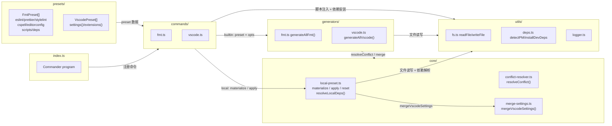

# CLAUDE.md

一键式项目格式化和 VSCode 配置初始化的 CLI 工具。它从预定义预设生成 ESLint、Prettier、Stylelint、CSpell、EditorConfig 配置和 VSCode 设置，具备智能合并和冲突解析功能。

## 技术要求

- **Node.js 18+** (仅 ESM 运行时)
- **bun** (包管理器 & 任务执行器)
- **模块系统** ESM-only（"type": "module"）

## 技术栈选型

| 层面     | 技术                       |
| -------- | -------------------------- |
| 语言     | TypeScript                 |
| CLI 框架 | Commander                  |
| 终端样式 | Chalk 5                    |
| 构建     | tsup                       |
| 测试     | Vitest                     |
| 包管理   | Bun                        |
| 代码质量 | ESLint + Prettier + CSpell |

## 命令

```bash
bun run eslint                       # eslint
bun run cspell                       # cspell
bun run type:check                   # ts 类型检查
bun run format                       # 格式化代码
bun run test                         # 单元 + 验收
bun run test --project unit          # 单元测试
bun run test --project acceptance    # 验收测试
```

**注意：**

- 验收测试会启动 `dist/index.js` — 如果 dist 是旧的，在 `test` 前先运行 `build`
- 验收测试较慢，**不要跑全量验收**。优先用 `-t` 过滤只跑与改动相关的必要测试：

## 项目目录

```
src/
├── commands/         # CLI 命令处理器 (fmt, vscode, init, update, vpn, show)
├── generators/       # 文件生成逻辑（写目标配置用） (fmt, vscode, init)
├── core/             # 核心决策层：冲突解析、设置合并、本地预设物化/应用
├── presets/          # 预设定义 (提供预设模板)
│   ├── fmt/          # fmt 预设模板 (web-vue, web-react, nest, node 等)
│   ├── vscode/       # vscode 预设模板
│   └── skills/       # init 命令复制到目标项目的技能文件源
├── utils/            # 工具函数 (deps, fs, logger, version, config等)
└── index.ts          # CLI 入口 (commander)
docs/
└── superpowers/
    ├── specs/        # 轻量级功能设计文档（中小功能的需求动机、架构决策、数据流）
    └── plans/        # 对应实现计划（task 拆分、代码片段、执行步骤）
openspec/
├── config.yaml       # openspec 配置
├── changes/archive/  # 已归档变更 (YYYY-MM-DD-<name>)，历史变更的设计动机、方案、架构等，仅历史回溯用
└── specs/            # 每个 capability 的权威 spec（含设计决策、边界条件、需求场景），记录了每个功能模块的需求场景、边界条件和设计决策（当前系统的部分功能设计说明书，有些小功能等没有添加进来）
tests/
├── unit/             # 单元测试 (并行, 快速超时)
├── acceptance/       # 验收测试 (串行, 进程池, 30s 超时)
└── helpers/          # 测试辅助工具 (.ts)
```

### 设计文档参考（agent 必读）

当任务涉及**重构、架构调整、功能扩展**等影响设计意图的改动时，先按文件名匹配相关文档，理解当初的设计决策和方案取舍后再改代码。复杂功能查阅 OpenSpec，中小功能查阅 Superpowers docs，小改动无需查阅。

- `openspec/specs/<capability>/spec.md` — 功能模块权威 spec（需求场景、边界条件）
- `openspec/changes/archive/` — 历史变更记录（设计动机、方案取舍）
- `docs/superpowers/specs/` — 轻量级功能设计文档（架构决策、数据流）
- `docs/superpowers/plans/` — 实现计划（task 拆分、执行步骤）

小 bug 修复、格式调整等局部改动无需查阅。

## 架构数据流图



## Health Stack

- lint: bun run lint
- test: vitest run
- format: prettier --check "src/\*_/_.{ts,js,json}"
- gbrain: gbrain doctor --json
