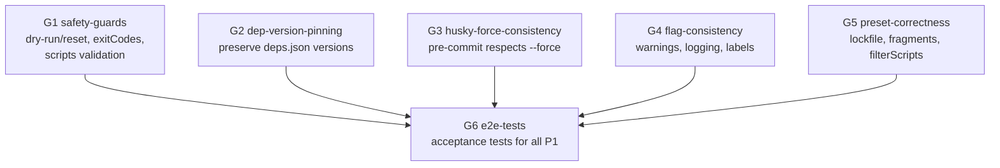

## Context

The `lux fmt` command has two execution paths — **builtin** (generates from preset functions) and **local** (copies from materialized `~/.lux/preset/fmt/<name>/`). Both paths handle file writing, script injection, dependency installation, and husky setup. A dual-agent code review found 22 bugs: 6 P1 (data loss, corruption, silent failures), 13 P2 (incorrect behavior, UX), and 3 P3 (polish).

The core structural problem is that the two paths evolved independently with duplicated logic but divergent safety checks. This change fixes all bugs while maintaining the existing two-path architecture — no refactor to unify the paths.

## Goals / Non-Goals

**Goals:**
- Fix all 6 P1 bugs that cause data loss, state corruption, or silent CI failures
- Fix P2 bugs that affect preset correctness (lockfile materialization, lintStagedFragments, filterScripts false positives)
- Fix P2 UX bugs (dry-run labels, flag warnings, force hints)
- Add E2E acceptance tests using temp directories to validate fixes
- Maintain backward compatibility — no behavioral changes to valid use cases

**Non-Goals:**
- Refactoring the two-path architecture into a unified pipeline
- Adding new features or capabilities beyond fixing existing bugs
- Changing the preset template format or CLI interface
- Fixing P3 bugs in this iteration (can be addressed separately)

## Architecture Visualization

## Decisions

### Implementation Sequencing

- **G1 safety-guards**: Foundation — must land first since other groups depend on `--dry-run` guard in `resetLocalPreset`
- **G2 dep-version-pinning**: Independent of G1, touches `shared.ts` and both paths in `fmt.ts`
- **G3 husky-force-consistency**: Independent, touches `initHusky()` in `fmt.ts`
- **G4 flag-consistency**: Independent, touches logging and warning code in `fmt.ts`
- **G5 preset-correctness**: Independent, touches `local-preset.ts` materialization and `filterScripts`
- **G6 e2e-tests**: Depends on all prior groups — validates everything

### Decision: How to handle `--dry-run --reset`

**Chosen**: Guard at the call site in `fmt.ts` — if `opts.dryRun`, log `[dry-run] Would reset local preset` and skip the `resetLocalPreset()` call entirely. Also add a secondary guard inside `resetLocalPreset` itself for defense-in-depth.

**Alternative considered**: Guard only inside `resetLocalPreset`. Rejected because the function is also called from `vscode.ts`, and the semantics are clearer at the call site.

### Decision: How to preserve dep versions from `deps.json`

**Chosen**: Change `executeLocalPath` and `executeBuiltinPath` to pass the full `depsToInstall` map (name→version) instead of just `Object.keys()`. Then modify `addDepsToManifest` to accept an optional version map and prefer pinned versions over re-fetching latest.

**Alternative considered**: Store versions in `deps.json` as `"latest"` and always resolve. Rejected because some teams pin versions intentionally.

### Decision: `filterScripts` matching strategy

**Chosen**: Use exact prefix/segment matching: split key by `:`, check if any segment exactly equals the tool name (e.g., `stylelint`, `cspell`, `lint-staged`, `editorconfig`). This avoids false positives like `lint:css` matching `stylelint`.

**Alternative considered**: Regex-based matching. Rejected because tool names are well-defined and segment splitting is simpler.

### Decision: Lockfile in materialization

**Chosen**: Do NOT resolve `<lockfile>` during materialization. Store the placeholder as-is. Resolve at apply time when the package manager context is known.

**Alternative considered**: Store a sentinel like `<detect-lockfile>`. Rejected — `<lockfile>` is already the established placeholder syntax.

### Validation Strategy

- **Unit tests**: Each fix gets at least one unit test covering the bug scenario
- **E2E acceptance tests**: Create temp project directories and run the actual CLI, verifying:
  - `--dry-run --reset` does not delete preset directory
  - Bad package.json sets exitCode = 1
  - Scripts merge handles non-object `scripts` field safely
  - `--force` controls husky pre-commit overwrite
  - Dep versions from `deps.json` are preserved
  - `filterScripts` does not produce false positives

### Design Pivot Boundaries

**Allowed without review:**
- Implementation details of logging message wording
- Order of guard checks in safety conditions
- Exact test structure and naming

**Must stop for review:**
- Changes to the `resetLocalPreset` API surface
- Changes to `collectDepsFromRegistry` return type
- Any modification to how `--force` interacts with `neverOverwrite` rules
- Relaxing the filterScripts matching (e.g., reverting to substring)

## Over-Engineering Traps

- **Trap: "Unified execution pipeline"** — The two paths (builtin/local) have legitimately different concerns (generation vs copy). Don't abstract them into one. Fix bugs in-place.
- **Trap: "Comprehensive error recovery for local apply"** — Non-atomic operations are acceptable here; adding transaction-like rollback is disproportionate to the risk.
- **Trap: "Generic script filtering engine"** — The filterScripts fix is a targeted matching improvement, not a plugin system.

## Risks / Trade-offs

### Blocking Risks

- If `addDepsToManifest` cannot accept version maps without breaking its existing callers (other commands), stop and reassess the pinning strategy.
- If the `filterScripts` segment-matching approach breaks any existing preset script keys, update the matching logic before continuing.

### Trade-offs

- **filterScripts exact matching** → Slightly more restrictive, but prevents data-loss bugs from false positives. If a future preset uses creative script naming, the matching rule is explicit and documented.
- **Not resolving lockfile at materialization** → Materialized presets contain `<lockfile>` literally, but this is correct because the target project's PM is unknown at materialization time.
