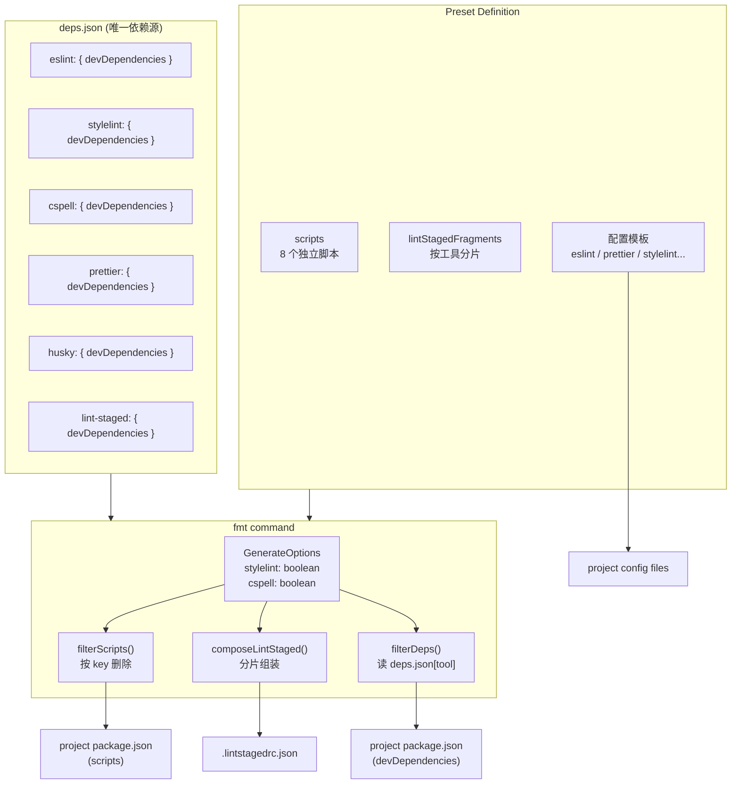
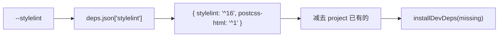
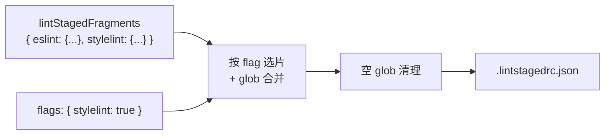

## Context

lux fmt 命令为项目生成 lint/format 配置并注入脚本和依赖。当前架构存在三方面问题：

1. **脚本层面**：聚合脚本 `"lint": "eslint . && cspell && tsc --noEmit && stylelint \"...\""` 的 `&&` 链导致短路——eslint 失败后，后续工具的错误不可见。
2. **过滤层面**：`filterScripts()` 用正则剥离 `&& stylelint "..."` 段落，脆弱且难维护。`isNotXxxDep()` 系列函数按包名硬编码判断归属，新增工具需改代码。
3. **依赖层面**：依赖定义在 preset TypeScript 代码的 `dependencies.dev` 数组中，与 materialized preset 的 template `package.json` 形成双源，自定义 preset 用户无法脱离 TypeScript 管理。

## Goals / Non-Goals

**Goals:**

- 消除 `&&` 短路：拆分聚合脚本为 8 个独立工具脚本
- 引入 `deps.json` 作为唯一依赖源，使自定义 preset 完全不需要 TypeScript 代码即可管理依赖
- 简化 `filterScripts`：从正则内容剥离改为按 key 删除
- 动态组装 `.lintstagedrc.json`：按工具分片定义，按 flag 组装输出
- 翻转 flag 语义：从 `noStylelint` 改为 `stylelint: boolean`，更直观

**Non-Goals:**

- 独立子命令（如 `lux stylelint install`）— 保持 flag 形式
- 生成 `format:check` 脚本
- 主动删除用户已有的依赖或脚本
- 重构配置文件生成逻辑（eslint.config.mjs, .prettierrc 等）

## Architecture Visualization



### 数据流：依赖安装



### 数据流：lint-staged 组装



## Decisions

### D1: deps.json 格式 — 按工具分组

```json
{
  "eslint": { "devDependencies": { "eslint": "^9.0.0", "typescript-eslint": "^8.0.0" } },
  "stylelint": { "devDependencies": { "stylelint": "^16.0.0", "postcss-html": "^1.0.0" } }
}
```

**替代方案**：扁平数组 + tool tag（`{ name: "eslint", tool: "eslint" }`）。拒绝——需要遍历全部条目才能找到某工具的依赖；按工具分组支持直接 `deps[tool].devDependencies` 访问。

**理由**：自定义 preset 用户只需编辑一个 JSON 文件控制所有依赖，直观且无歧义。

### D2: deps.json 位置 — 与 preset 配置文件同级

Builtin: `src/presets/fmt/<name>/deps.json`
Materialized: `~/.lux/preset/fmt/<name>/deps.json`

**理由**：materialize 流程已经复制 preset 文件，deps.json 走同样路径。两种来源读取同一格式。

### D2.1: deps.json 版本策略 — `<latest>` 占位符

deps.json 中的版本字段使用 `<latest>` 占位符（与当前 template package.json 行为一致），运行时通过 `fetchPackageVersion` 解析为实际最新版本。

```json
{
  "eslint": { "devDependencies": { "eslint": "<latest>", "typescript-eslint": "<latest>" } },
  "stylelint": { "devDependencies": { "stylelint": "<latest>", "postcss-html": "<latest>" } }
}
```

**替代方案**：硬编码版本范围（如 `^9.0.0`）。拒绝——版本经常变化，每次升级需要手动更新所有 preset 的 deps.json。`<latest>` 让 npm registry 决定版本，零维护成本。

### D3: 从 preset 代码中移除 dependencies

`dependencies: { dev: [...] }` 字段完全删除。deps.json 是唯一来源。

**理由**：消除双源问题。自定义 preset 不需要写 TypeScript，只需 deps.json。

### D4: 脚本拆分 — 8 个独立脚本

```
eslint / eslint:fix / stylelint / stylelint:fix / cspell / type:check / format / lint-staged
```

每个 preset 定义自己的 glob pattern。不碰用户已有的 `lint` / `lint:fix`。

**理由**：每个工具独立运行，消除 `&&` 短路。按 key 过滤天然简单。

### D5: lint-staged 分片留在 preset 代码中，不固化到本地

分片定义和 scripts 一样留在 preset TypeScript 代码中，不外置到文件。`.lintstagedrc.json` 不走 materialize 流程，每次从分片动态组合生成。

**理由**：lint-staged glob 和 preset 的工具配置强耦合。分片体量小，不需要独立文件管理。不固化意味着本地/custom preset 路径没有 lint-staged 支持（没有 preset 代码可组合），但这是可接受的 trade-off——自定义 preset 主要定制依赖和脚本。

### D6: Flag 语义翻转 — 正值 boolean

```
// Before: noStylelint = options.stylelint !== true  (默认 true)
// After:  stylelint  = options.stylelint === true   (默认 false)
```

**理由**：`noStylelint` + 传 `--stylelint` 是双重否定，不直观。`if (opts.stylelint)` 读起来自然。

### D7: 模板 package.json 简化

Materialized `package.json` 只保留 `scripts`，移除 `devDependencies`。依赖信息全部来自 `deps.json`。

**理由**：消除 `<latest>` 占位符系统。`resolveLocalDeps` 直接读 deps.json，不需要解析 template package.json。

### D8: builtin preset deps.json 加载策略 — 静态 import 内嵌

Builtin preset 通过静态 `import deps from './deps.json'` 加载依赖数据。tsup (esbuild) 编译时自动内联 JSON 到 bundle，运行时不依赖文件系统路径。

Materialize 时将内嵌的 deps 对象写出到 `~/.lux/preset/fmt/<name>/deps.json`，apply 路径统一从文件系统读取。

**替代方案**：运行时用 `import.meta.url` + 相对路径读源码目录下的 deps.json。拒绝——tsup 打包后 `import.meta.url` 指向 `dist/index.js`，源码相对路径失效。

**理由**：消除 `import.meta.url` 路径脆弱性。静态 import 是零配置方案（项目已启用 `resolveJsonModule`，tsup 默认支持 JSON loader）。

### D9: fmt 命令单 preset 按需 materialize

`lux fmt <preset-name>` 仅 materialize 目标 preset，不触碰其他已固化的 preset。用户可能已手动修改其他 materialized preset 的配置，全量 materialize 会覆盖这些修改。

**理由**：保护用户的本地修改。materialize 是破坏性操作（覆盖目标目录），应限定在最小范围内。

## Over-Engineering Traps

- **通用工具注册系统**：不要做插件式注册表，deps.json 是数据文件不是框架，直接读取即可。
- **可配置脚本模板**：不要加模板变量。脚本硬编码在 preset 中，和现在一样。
- **lint-staged 分片 DSL**：不要发明组合语言。TypeScript 对象按工具名 key，`Object.assign` 式合并即可。

## Risks / Trade-offs

- **[BREAKING] 用户已有的 `lint`/`lint:fix` 脚本** → lux 不碰已有脚本。用户保留旧 `lint` 脚本，同时获得新的独立脚本。文档应建议手动迁移。
- **[Risk] 旧 materialized preset 没有 deps.json** → apply 路径需处理缺失 deps.json 的情况，给出明确错误提示并建议 `--reset`。
- **[Risk] flag 翻转引入细微 bug** → 机械性改动但文件多，需充分测试 flag 相关分支。
- **[Trade-off] lint-staged 不固化到本地** → 本地/custom preset 路径没有 lint-staged 支持（没有 preset 代码可组合），只有 builtin 路径能动态生成 `.lintstagedrc.json`。可接受——自定义 preset 主要定制依赖和脚本。
